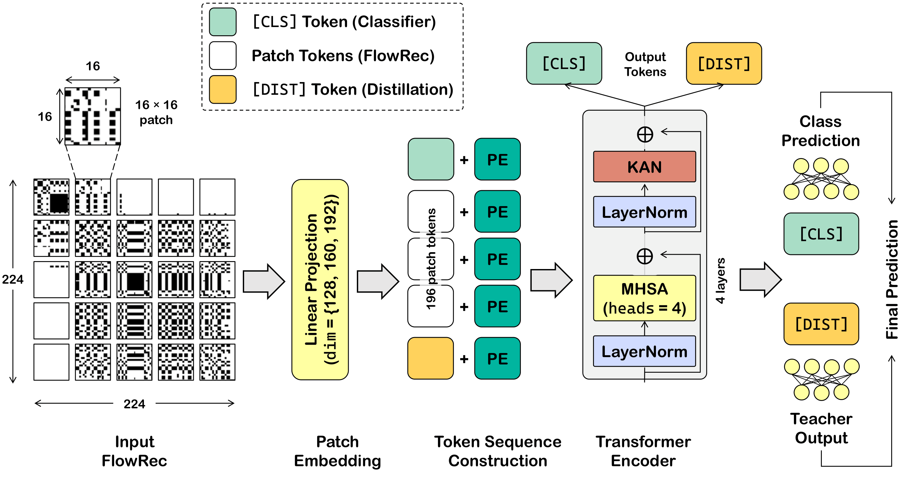
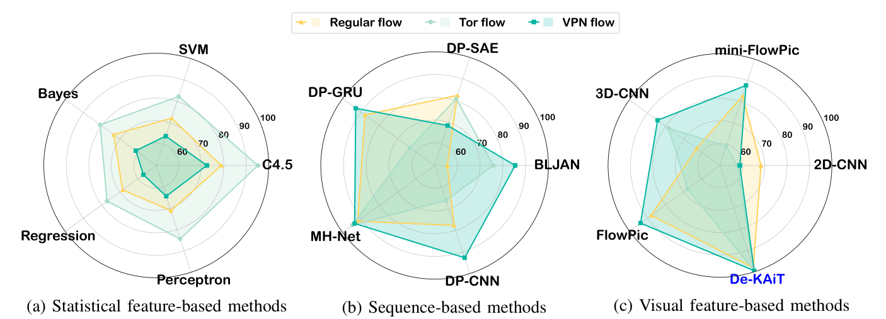
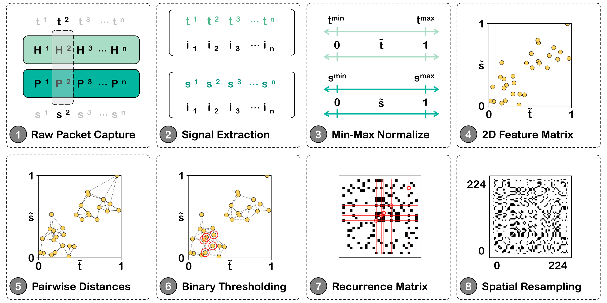
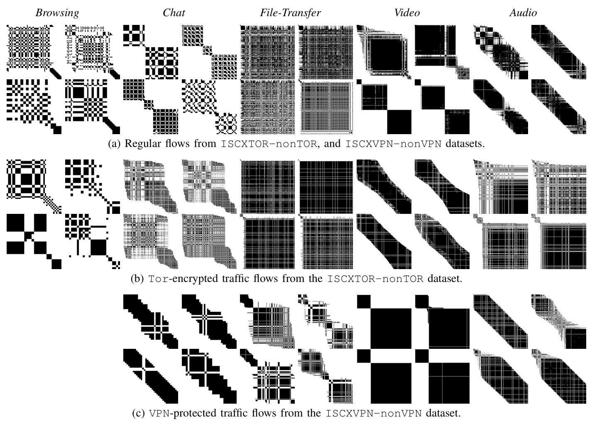

# De-KAiT

### Data-Efficient Kolmogorov–Arnold Image Transformer for Visual Classification of Encrypted and Obfuscated Network Traffic Flows

---

## Overview

Network traffic classification is a fundamental task in network and communication security.
With the rapid proliferation of encrypted and anonymized traffic (TLS/HTTPS, Tor, commercial VPN
services), payload-centric Deep Packet Inspection (DPI) has become largely infeasible, necessitating
a shift toward **flow-level** analysis.

**De-KAiT** proposes a new visual formulation of flow-level traffic classification using
**recurrence plots** — single-channel structured images that encode pairwise similarities between
normalized packet states (inter-packet arrival timestamps and payload sizes). On top of this
representation, De-KAiT is a lightweight, data-efficient vision transformer combining three ideas:

- 🔁 **Recurrence-Plot Patch Embedding** — single-channel Conv2D patch tokenization directly from recurrence plots, without artificial RGB expansion, preserving flow-level geometry even under Tor/VPN obfuscation
- 🎯 **Dual-Token Self-Attention** — a `[CLS]` (classification) + `[DIST]` (distillation) dual-token mechanism for robust, low-data flow-level aggregation, stabilizing optimization in scarce-data settings
- 🧠 **KAN Feed-Forward Sub-layer (KAN-FFN)** — replaces the fixed-activation MLP with Kolmogorov–Arnold Network-based edge-wise learnable univariate activations, better suited to the non-Gaussian, class-dependent token distributions of recurrence plots

  
   
  <em>Figure 1: De-KAiT architecture. A 224×224 single-channel recurrence plot is partitioned into
  196 non-overlapping 16×16 patches, linearly projected to d-dimensional tokens, augmented with
  learnable [CLS] and [DIST] tokens and positional embeddings, and processed by L stacked De-KAiT
  encoder blocks (MHSA + KAN-FFN). Final prediction is obtained by averaging the [CLS] and [DIST]
  head outputs.</em>

---

## Why Visual? State-of-the-Art Comparison

Visual feature-based methods consistently outperform both statistical and sequence-based methods
across all three traffic conditions (Regular, Tor-encrypted, VPN-protected). Among all visual
methods, **De-KAiT achieves the highest accuracy**, as shown in the radar plots below.

  
   
  <em>Figure 2: Radar plots comparing top-performing statistical (C4.5, SVM, Bayes, Regression,
  Perceptron), sequence-based (DP-SAE, DP-GRU, BLJAN, MH-Net, DP-CNN), and visual
  (mini-FlowPic, 3D-CNN, 2D-CNN, FlowPic, <strong>De-KAiT</strong>) methods on the
  ISCXTOR-nonTOR and ISCXVPN-nonVPN datasets across Regular, Tor, and VPN flows.</em>

---

## Recurrence Plots

Each network flow is converted to a **224×224 single-channel recurrence plot** using two
packet-level features: normalized inter-packet arrival timestamps and normalized payload sizes.
The plot encodes pairwise state similarity via a Heaviside threshold (ε = 0.20), followed by
spatial resampling.

The resulting representations are visually and structurally discriminative:

| Traffic Class | Recurrence Pattern |
|---|---|
| **Browsing** | Irregular checkerboard; no diagonal dominance (bursty HTTP/HTTPS) |
| **Chat** | Structured diagonal + off-diagonal blocks (idle/active alternation) |
| **File Transfer** | Dense, uniformly tiled parallel diagonals (bulk transfer regularity) |
| **Video** | Large solid blocks with sharp transitions (frame-rate-driven stationarity) |
| **VoIP** | Fine-grained diagonal stripes at high global density (constant codec timing) |

Critically, **broad class-specific global geometry is preserved** even under Tor encryption and
VPN protection, where local textures change significantly.

  
   
  <em>Figure 3: Recurrence plot construction pipeline — from raw network flow to
  224×224 single-channel structured image.</em>

 

  
   
  <em>Figure 4: Recurrence plots across five application categories (Browsing, Chat, File-Transfer,
  Video, Audio/VoIP) under (a) Regular, (b) Tor-encrypted, and (c) VPN-protected traffic conditions,
  with four representative samples per category per condition.</em>

---

## Model Variants

| Variant | Embed Dim `d` | FFN Dim `d_ff` | Heads | Patches | Params (M) | FLOPs (G) |
|---|---|---|---|---|---|---|
| **De-KAiT-Tiny** | 128 | 256 | 4 | 196 | **2.94** | **1.11** |
| **De-KAiT-Small** | 160 | 320 | 4 | 196 | 4.58 | 1.71 |

Both variants are evaluated at encoder depths **L ∈ {2, 4, 6, 8}**, with KAN-FFN expansion ratio
`r = 2.0`, patch size `p = 16`, per-head dimension `d_h = 32`, and dropout `0.1`.

For each experimental configuration, both the **best-validation checkpoint** (`_best.pth`) and the
**final epoch checkpoint** (`_last.pth`) are provided to support direct inference, fine-tuning, and
reproducibility verification.

> 📦 **[Download Pre-Trained Weights (Google Drive)](https://drive.google.com/drive/folders/16-FH9uwxcavNENKFX9RsC34alaDvsBkD?usp=sharing)**
